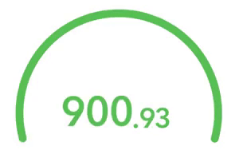
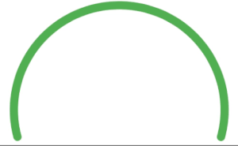
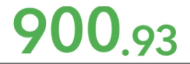
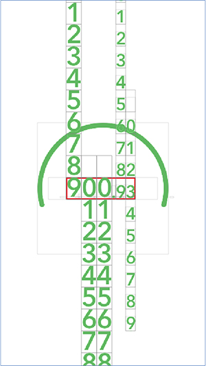
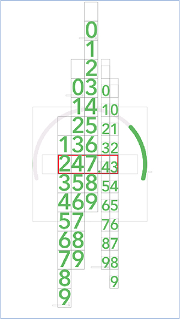

## iOS Animated Countdown & Chart View (Swift)

A fancy, easy to implement countdown component for iOS. 
It supports iOS 9+ versions.
Views are drawn by CoreAnimation, and you can define CAMediaTimingFunction to set your custom animation parameters.





### Integration Steps


## Chart View



Add a subview (UIView) to draw the chart, and set ChartView class as reference to related view.. 

Add an IBOutlet to your reference ViewController for ChartView.

```
@IBOutlet weak var chartView: ChartView!
```

In your Viewcontoller, initialize ChartView with required parameters. 
```
// Define colors.
let fillColor = UIColor(red: 92/255, green: 184/255, blue: 92/255, alpha: 1.0)
let backgroundColor = UIColor(red: 240/255, green: 235/255, blue: 239/255, alpha: 1.0)

// Define the angle for full chart view. 
let fullArcAngle : CGFloat = 210.0  

// Initialize
chartView.initializeView(arcWidth: 9.0, arcFillColor: fillColor, arcBackgroundColor: backgroundColor, fullArcAngle: fullArcAngle)

```

And now animate the chart.

```
let totalValue = 900.93
let toValue  = 247.43

// Animate to related ratio
let ratio = toValue / totalValue

self.chartView.animateCircle(toRatio: ratio)
```


Do the same steps for CountdownView.

## Countdown View



Add a subview (UIView) to draw the chart, and set CountdownView class as reference to related view.. 

Add an IBOutlet to your reference ViewController for CountdownView.

```
@IBOutlet weak var countdownView: CountdownView!

```
In your Viewcontoller, initialize CountdownView with required parameters. 

```
// Define colors.
// Font color
let fillColor = UIColor(red: 92/255, green: 184/255, blue: 92/255, alpha: 1.0)

// Initial (total) value of countdown value.
let totalValue = 900.93

// New value to animate.
let toValue  = 247.43

// Initialize
self.countdownView.initializeView(totalValue: totalValue, fontColor : fillColor)
```

And now animate the countdown.

```
self.countdownView.animateCountdown(toValue: toValue)
```

# How it works?

There is a UICollectionView that contains UIScrollView inside. And this scrollview also contains UIStackView that contains UILabels that presents numeral digits. I hope it is not mind confusing.

There are two state for animation steps. As seen below, stackView is scrolled inside UIScrollView to show related digit.

Initial State (value : 900.93) |  Final State (value: 247.43)
:-------------------------:|:-------------------------:
  |  


That's all.

There is a sample project available.
